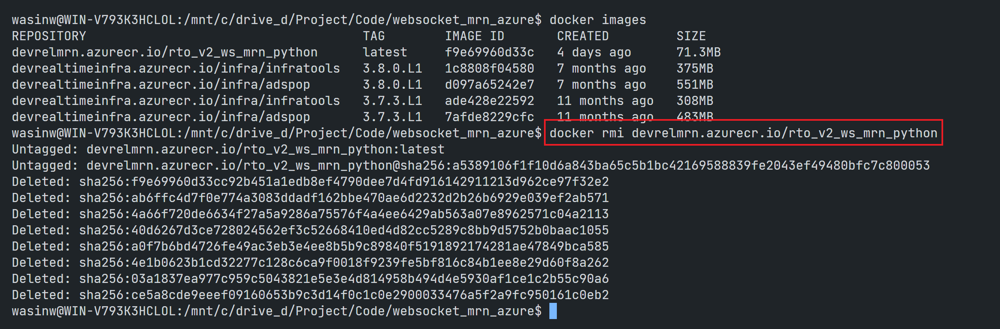

# How to Deploy WebSocket Application To Azure Container Registry Repository - Development Detail
- version: 1.0.0
- Last update: Jan 2025
- Environment: Docker and Azure CLI
- Prerequisite: [Access to Azure](#prerequisite)

## <a id="app_preparation"></a>Application Container Preparation

Let’s start with how to prepare your application image on your local machine. Developers need the following files from the [WebSocket API Machine Readable News Example with Python](https://github.com/LSEG-API-Samples/Example.WebSocketAPI.Python.MRN) project to create an application image with Docker.

1. [mrn_console_rto_v2.py](https://github.com/LSEG-API-Samples/Example.WebSocketAPI.Python.MRN/blob/master/mrn_console_rto_v2.py) Python application file.
2. [requirements.txt](https://github.com/LSEG-API-Samples/Example.WebSocketAPI.Python.MRN/blob/master/requirements.txt) Python dependencies configurations file.

### Docker Image Set Up

Next, create a text file name ```Dockerfile``` as a blueprint for our image.

```Docker
#Build stage
ARG PYTHON_VERSION=3.11
ARG VARIANT=slim-bookworm
FROM python:${PYTHON_VERSION}-slim-bookworm AS builder 

LABEL maintainer="LSEG Developer Relations"

#Copy requirements.txt
COPY requirements.txt .

# install dependencies to the local user directory (eg. /root/.local)
RUN pip install --trusted-host pypi.python.org --trusted-host files.pythonhosted.org --trusted-host pypi.org --no-cache-dir --user -r requirements.txt

# Run stage
FROM python:${PYTHON_VERSION}-alpine3.20
WORKDIR /app

# Update PATH environment variable + set Python buffer to make Docker print every message instantly.
ENV PATH=/root/.local:$PATH \
    PYTHONUNBUFFERED=1\
    PYTHONIOENCODING=utf-8\
    PYTHONLEGACYWINDOWSSTDIO=utf-8

# copy only the dependencies installation from the 1st stage image
COPY --from=builder /root/.local /root/.local
COPY mrn_console_rto_v2.py .

#Run Python
ENTRYPOINT ["python", "mrn_console_rto_v2.py"]
```

Please note that if you are not in the controlled network environment (like our beloved ZScaler), you can replace the ```RUN pip instal ....``` line above with the following Docker instruction instead.

```Docker
# install dependencies to the local user directory (eg. /root/.local)
RUN pip install --no-cache-dir --user -r requirements.txt
```
### Docker Image Testing

To test our newly created Dockerfile, developers can build a test image on their local machine with a ```docker build``` command. 

```bash
docker build -t rto_v2_ws_mrn_python .
```

Then verify if the build is succeed with a ```docker images``` command.


You can check on [RTO Version 2 Authentication console Docker example](https://github.com/LSEG-API-Samples/Example.WebSocketAPI.Python.MRN/tree/master?tab=readme-ov-file#rto-version-2-authentication-console-example) section of the MRN example project to see how to run an application locally to test your RTO account and MRN subscription.


That is all for a Docker image set up stage.

## <a id="azure_setup"></a>Azure Container Registry Repository Set Up

That brings us to the second step, create your repository the Container Registry service. I am demonstrating with the Azure Portal. If you prefer using the Azure CLI, please check [this document](https://learn.microsoft.com/en-us/azure/container-registry/container-registry-get-started-azure-cli).

Once you have logged in to [Azure Portal](https://azure.microsoft.com/) website, type ```Container Registry``` on the portal search box to find the Container Registry service. Then click into the service.


Please note that the next time you logged in to the portal, the Container Registry service will be available on the index page.


Now you are in the Container Registry page, click the ```+ Create``` button to create new registry for storing the MRN Python container.


In the **Basics*** tab, select your Azure subscription and choose ```Create new``` option for the Resource group value.


I am naming my resource group as *mrn_resource*.


Next, input your ```Registry name```. I am choosing *devrelmrn* as my registry resource name, you may choose the one that you prefer. Then select your nearest location (*Southeast Asia* in my case) and choose your prefer [Pricing Plans](https://azure.microsoft.com/en-us/pricing/details/container-registry/#pricing) which I am choosing the *Basic plan* for this demonstration.


Next, click the ```Review + create``` button.

Once the page shows *Validation passed* message, click the ```Create``` button, then Azure will create your Container Registry resource.


When the page shows *Your deployment is complete* message, click on the ```Go to resource``` button.


Now we are on the newly created *devrelmrn* Container Registry main page. The URL for this registry is showed under the ```Login server``` information which is **devrelmrn.azurecr.io**. You can use this URL name to refer to this container repository.


If you scroll the page down, there are some useful links on the **Get started** tab like the ```Push an image``` button that give you a quick guide on how to push an application image to this **devrelmrn.azurecr.io** container registry.


The next time you access the main Container Registry service page, this repository will be available on the main page as follows.


That is all for the repository preparation.

## <a id="push_image"></a>Push your local application image to Azure Container Registry Repository

Now it is time to push an application image to the newly created **devrelmrn.azurecr.io** container registry. You need the [Azure CLI](https://learn.microsoft.com/en-us/cli/azure/) tool in this step.

The first step is log in to your Azure account via the CLI tool. I am demonstrating with my Ubuntu 20.04 WSL. 

```bash
$ az login 
```

The CLI tool opens a  web browser for authenticating with [Azure sign-in page](https://learn.microsoft.com/en-us/entra/identity-platform/v2-oauth2-auth-code-flow) by default. 


Then log in to the opened browser with your Azure account and credential. The page should shows this logged in success message.


Then proceed the steps on your CLI terminal by choosing your subscription tenant. 


If you're using Azure CLI over a proxy server, you may encounter the ```SSLError("bad handshake: Error([('SSL routines', 'tls_process_server_certificate', 'certificate verify failed')],)",)``` error message. To address this issue, please follows an instruction on this [Azure CLI: Work behind a proxy](https://learn.microsoft.com/en-us/cli/azure/use-azure-cli-successfully-troubleshooting#work-behind-a-proxy) page.

There are other ways and options to log in to Azure service via the Azure CLI, please check this [Sign into Azure interactively using the Azure CLI](https://learn.microsoft.com/en-us/cli/azure/authenticate-azure-cli-interactively) document for more detail.

Now you have logged in to Azure, the next step is log in to the the registry instance with the registry resource name (**not the fully qualified login server name**).

```bash
$ az acr login --name <registry-name>
```

Example:

```bash
$ az acr login --name devrelmrn
```


Next, tag the image with the fully qualified name of the registry name (which is **devrelmrn.azurecr.io** in this case) with a [Docker tag command](https://docs.docker.com/reference/cli/docker/image/tag/).

```bash
$ docker tag rto_v2_ws_mrn_python devrelmrn.azurecr.io/rto_v2_ws_mrn_python
```

Please be noticed that I did not specify the version of this image, so the version is ```latest``` by default


Finally, push an image to Azure Container registry with a [Docker push command](https://docs.docker.com/reference/cli/docker/image/push/) command as follows

```bash
$ docker push <fully qualified login server name>/image-name:version
```

Example:

```bash
$ docker push devrelmrn.azurecr.io/rto_v2_ws_mrn_python
```


A ```docker images``` command shows this newly pushed image as follows.


If you get back to your container registry on the Azure panel, an image will be available on the **Services --> Repositories** tab.


You can click on an image name to see its details.


Now your image is deployed on Azure Container registry, and you can pull it for later use anytime.

That is all I have to say about how to push an image to Azure.

## <a id="pull_image"></a>Pull your image from the Container Registry to local

My next point is how to pull that image to run it locally. To pull an image from Azure Container Registry to your local environment, you can use a [Docker pull command](https://docs.docker.com/reference/cli/docker/image/pull/) with ```<registry-name>.azurecr.io/<image-name>``` format as an image name.

Please note that you need to log in to Azure account and your container registry instance with the CLI tool before running a Docker pull command. Otherwise, a command returns "unauthorized" error message back to you. You can use a ```az account show -o jsonc``` command to check if your Azure CLI session is logged in.


```bash
$ az login

$ az acr login --name devrelmrn

$ docker pull devrelmrn.azurecr.io/rto_v2_ws_mrn_python
```


A ```Docker images``` shows your newly pull image as follows:


Then you can run this image locally from the steps on **Docker Image Testing** section above.

Alternatively, you can use a [Docker run command](https://docs.docker.com/reference/cli/docker/container/run/) with ```--pull=always``` parameter to pull an image from Azure automatically and run it with a single command.

Note: You still need to log in to Azure account and your container registry instance with the CLI tool.

```bash
$ az login

$ az acr login --name devrelmrn

$ docker run --pull=always --name mrn_azure -it --env-file .env devrelmrn.azurecr.io/rto_v2_ws_mrn_python MRN_STORY
```


To delete an image, you can use a [Docker image rm command](https://docs.docker.com/reference/cli/docker/image/rm/) with the ```<registry-name>.azurecr.io/<image-name>``` format as an image name.
Note: A associate container must be stopped and deleted before delete an image.

```bash
$ docker rmi devrelmrn.azurecr.io/rto_v2_ws_mrn_python
```



That cover how to pull an image from Azure and run it locally.