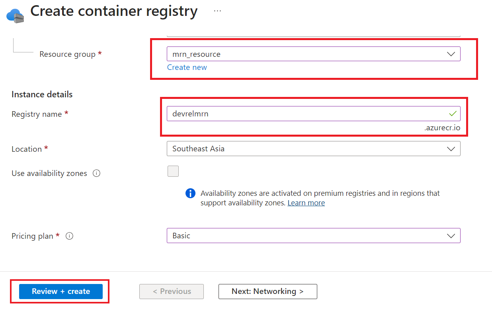

# How to Deploy WebSocket Application To Azure Container Registry Repository

## Overview

This project shows a step-by-step guide to public a container application to Microsoft [Azure Container Registry](https://azure.microsoft.com/en-us/products/container-registry) repository. I am reusing the [MRN WebSocket Python example application](https://github.com/LSEG-API-Samples/Example.WebSocketAPI.Python.MRN) (RTO with Version 2 Authentication) as an example application. However, the concept and main logic can be applied to any technologies that support containerization. 

**Note**: 
- My Azure Account is based on my Visual Studio Enterprise Subscription service which is may be different from your Azure account type.
- The Azure Portal website UI/UX are subjected to change.

## Introduction to Azure Container Registry

[Azure Container Registry](https://azure.microsoft.com/en-us/products/container-registry) is Microsoft own container hosing platform (the same as [Docker](https://www.docker.com/)'s [dockerhub](https://hub.docker.com/)). The repository handles private Docker/[OCI - Open Container Initiative](https://opencontainers.org/) images and artifacts with a fully managed, geo-replicated instance of OCI distribution. Developers can build, store and manage containers/artifacts to connect to across Azure services such as [Azure Kubernetes Service (AKS)](https://azure.microsoft.com/en-us/products/kubernetes-service), [Azure App Service](https://azure.microsoft.com/en-us/products/app-service) and much more. 

The service also lets Developers/DepOps streamline building, testing, pushing, and deploying images with Tasks. The example is developers can targeting a container registry from a continuous integration and continuous delivery (CI/CD) tool such as [Azure Pipelines](https://learn.microsoft.com/en-us/azure/devops/pipelines/ecosystems/containers/acr-template) or [Jenkin](https://jenkins.io/).


This project shows the first step which is how to set up a registry, upload an application image and then how to pull it to a local environment. 

## Prerequisite  

This project requires the following software and account on your machine.

1. RTO Access credentials (Version 2 - Service ID) with MRN data permission.
2. [Microsoft Azure](https://azure.microsoft.com/en-us/get-started/azure-portal) account.
3. [Azure CLI](https://learn.microsoft.com/en-us/cli/azure/install-azure-cli) application.
4. [Docker desktop](https://www.docker.com/products/docker-desktop/).
5. Internet connection.

Please contact your LSEG representative to help you to access the RTO account and MRN service.

## Application Container Preparation

Developers need the following files from the [WebSocket API Machine Readable News Example with Python](https://github.com/LSEG-API-Samples/Example.WebSocketAPI.Python.MRN) project to create an application image with Docker.

1. [mrn_console_rto_v2.py](https://github.com/LSEG-API-Samples/Example.WebSocketAPI.Python.MRN/blob/master/mrn_console_rto_v2.py) Python application file.
2. [requirements.txt](https://github.com/LSEG-API-Samples/Example.WebSocketAPI.Python.MRN/blob/master/requirements.txt) Python dependencies configurations file.

### Docker Image Preparation

Next, create a file name ```Dockerfile``` as a blueprint for our image.

```Docker
#Build stage
ARG PYTHON_VERSION=3.11
ARG VARIANT=slim-bookworm
FROM python:${PYTHON_VERSION}-slim-bookworm AS builder 

LABEL maintainer="LSEG Developer Relations"

#Copy requirements.txt
COPY requirements.txt .

# install dependencies to the local user directory (eg. /root/.local)
RUN pip install --trusted-host pypi.python.org --trusted-host files.pythonhosted.org --trusted-host pypi.org --no-cache-dir --user -r requirements.txt

# Run stage
FROM python:${PYTHON_VERSION}-alpine3.20
WORKDIR /app

# Update PATH environment variable + set Python buffer to make Docker print every message instantly.
ENV PATH=/root/.local:$PATH \
    PYTHONUNBUFFERED=1\
    PYTHONIOENCODING=utf-8\
    PYTHONLEGACYWINDOWSSTDIO=utf-8

# copy only the dependencies installation from the 1st stage image
COPY --from=builder /root/.local /root/.local
COPY mrn_console_rto_v2.py .

#Run Python
ENTRYPOINT ["python", "mrn_console_rto_v2.py"]
```

Please note that if you are not in the controlled network environment (like our beloved ZScaler), you can replace the ```RUN pip instal ....``` line with the following Docker instruction instead.

```Docker
# install dependencies to the local user directory (eg. /root/.local)
RUN pip install --no-cache-dir --user -r requirements.txt
```
### Docker Image Testing

To test our newly created Dockerfile, developers can build a test image on their local machine with the ```docker build``` command. 

```bash
docker build -t rto_v2_ws_mrn_python .
```

Then verify if the build is succeed with the ```docker images``` command.


You can check on [RTO Version 2 Authentication console Docker example](https://github.com/LSEG-API-Samples/Example.WebSocketAPI.Python.MRN/tree/master?tab=readme-ov-file#rto-version-2-authentication-console-example) section of the MRN example project to see how to run an application locally to test your RTO account and MRN subscription.


That is all for the example image.

## Azure Container Registry Repository Preparation

The second step is to create your repository the Container Registry service. I am demonstrating with the Azure Portal. If you prefer using the Azure CLI, please check [this document](https://learn.microsoft.com/en-us/azure/container-registry/container-registry-get-started-azure-cli).

Once you have logged in to [Azure Portal](https://azure.microsoft.com/) website, type ```Container Registry``` on the portal search box to find the Container Registry service. Then click into the service.


Please note that the next time you logged in to the portal, the Container Registry service will be available on the index page.


Now you are in the Container Registry page, click the ```+ Create``` button to create new registry for storing the MRN Python container.


In the **Basics*** tab, select your Azure subscription and choose ```Create new``` option for the Resource group value.


I am naming my resource group as *mrn_resource*.


Next, input your ```Registry name```. I am choosing *devrelmrn* as my registry resource name, you may choose the one that you prefer. Then select your nearest location (*Southeast Asia* in my case) and choose your prefer [Pricing Plans](https://azure.microsoft.com/en-us/pricing/details/container-registry/#pricing) which I am choosing the *Basic plan* for this demonstration.



Next, click the ```Review + create``` button.

Once the page shows *Validation passed* message, click the ```Create``` button, then Azure will create your Container Registry resource.

When the page shows *Your deployment is complete* message, click on the ```Got to resource``` button.


์Now we are on the newly created *devrelmrn* Container Registry main page. The URL for this registry is showed under the ```Login server``` information which is **devrelmrn.azurecr.io**. You can use this URL name to refer to this container repository.


If you scroll the page down, there are some useful links on the **Get started** tab like the ```Push an image``` button that give you a quick guide on how to push an application image to this **devrelmrn.azurecr.io** container registry.


The next time you access the main Container Registry service page, this repository will be available on the main page as follows.


That is all for the repository preparation.

## Push your local application image to your Azure Container Registry Repository

์Now it is time to push an application image to the newly created **devrelmrn.azurecr.io** container registry. You need the [Azure CLI](https://learn.microsoft.com/en-us/cli/azure/) tool in this step.

The first step is log in to your Azure account via the CLI tool. I am demonstrating with my Ubuntu 20.04 WSL. 

```bash
$ az login 
```

The CLI tool opens a  web browser for authenticating with [Azure sign-in page](https://learn.microsoft.com/en-us/entra/identity-platform/v2-oauth2-auth-code-flow) by default. 


Then log in to the opened browser with your Azure account and credential. The page should shows this logged in success message.


Then proceed the steps on your CLI terminal by choosing your subscription tenant. 


If you're using Azure CLI over a proxy server, you may encounter the ```SSLError("bad handshake: Error([('SSL routines', 'tls_process_server_certificate', 'certificate verify failed')],)",)``` error message. To address this issue, please follows an instruction on this [Azure CLI: Work behind a proxy](https://learn.microsoft.com/en-us/cli/azure/use-azure-cli-successfully-troubleshooting#work-behind-a-proxy) page.

There are other ways and options to log in to Azure service via the Azure CLI, please check this [Sign into Azure interactively using the Azure CLI](https://learn.microsoft.com/en-us/cli/azure/authenticate-azure-cli-interactively) document for more detail.

Now you have logged in to Azure, the next step is log in to the the registry instance with the registry resource name (**note the fully qualified login server name**).

```bash
$ az acr login --name <registry-name>
```

Example:

```bash
$ az acr login --name devrelmrn
```


[tbd]

## Reference

- [Azure Container Registry page](https://azure.microsoft.com/en-us/products/container-registry)
- [Azure Container Registry documentation](https://learn.microsoft.com/en-us/azure/container-registry/)
- [Introduction to Azure Container Registry](https://learn.microsoft.com/en-us/azure/container-registry/container-registry-intro)
- [Quickstart: Create an Azure container registry using the Azure portal](https://learn.microsoft.com/en-us/azure/container-registry/container-registry-get-started-portal?tabs=azure-cli)
- [What is Azure Container Registry?](https://dev.to/makendrang/what-is-azure-container-registry-1f02) blog post.
- [How to install the Azure CLI](https://learn.microsoft.com/en-us/cli/azure/install-azure-cli)
